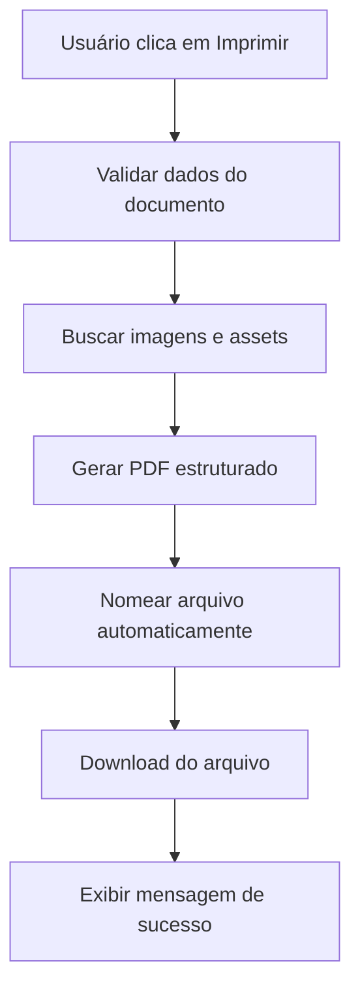

# 📄 Guia do Sistema de Impressão de Documentos

## Visão Geral

O sistema de impressão foi projetado para garantir que **TODOS** os documentos sejam gerados de forma completa, estruturada e profissional em formato PDF, seguindo o padrão A4.

---

## 🎯 Comportamento Padrão

Quando o usuário solicita a impressão de qualquer documento no sistema:

### 1. **Identificação Automática**
- O sistema identifica o tipo de documento (OS, Orçamento, Proposta, Contrato, etc.)
- Captura TODOS os dados relacionados ao documento

### 2. **Captura Completa de Conteúdo**
- ✅ Cabeçalhos e rodapés
- ✅ Logotipos e marcas d'água
- ✅ Tabelas de itens/serviços
- ✅ Observações e termos
- ✅ Assinaturas digitais
- ✅ QR Codes
- ✅ Imagens incorporadas

### 3. **Geração Estruturada**
- ❌ **NÃO** usa captura de tela (print screen)
- ❌ **NÃO** faz renderização parcial
- ✅ Gera PDF estruturado com jsPDF
- ✅ Mantém formatação A4 profissional
- ✅ Preserva margens e espaçamentos

### 4. **Nomenclatura Automática**
Padrão: `TIPO_NumeroDocumento_NomeCliente_Data.pdf`

Exemplos:
```
OS_14-2025_SpixMedicina_26-10-2025.pdf
PROP_001_JoaoSilva_26-10-2025.pdf
CONT_2025-010_EmpresaXYZ_26-10-2025.pdf
```

### 5. **Feedback Visual**
```
✅ Documento completo gerado com sucesso!
📄 OS_14-2025_SpixMedicina_26-10-2025.pdf
```

---

## 🛠️ Como Usar

### Para Desenvolvedores

#### 1. **Hook `usePrintDocument`**

```typescript
import { usePrintDocument } from '../hooks/usePrintDocument'

const MyComponent = () => {
  const { print, isPrinting, error } = usePrintDocument({
    documentType: 'ordem_servico',
    onSuccess: (result) => {
      console.log('PDF gerado:', result.filename)
    },
    onError: (error) => {
      console.error('Erro:', error)
    }
  })

  const handlePrint = async () => {
    await print(
      generateMyPDF, // Função que retorna Promise<Blob>
      {
        documentNumber: '14/2025',
        clientName: 'Spix Medicina',
        customFilename: 'documento_customizado.pdf' // Opcional
      }
    )
  }

  return (
    <button onClick={handlePrint} disabled={isPrinting}>
      {isPrinting ? 'Gerando...' : 'Imprimir'}
    </button>
  )
}
```

#### 2. **Componente `PrintDocumentButton`**

```typescript
import PrintDocumentButton from '../components/PrintDocumentButton'

<PrintDocumentButton
  documentType="ordem_servico"
  generatePDF={handleGeneratePDF}
  printOptions={{
    documentNumber: order.order_number,
    clientName: customer.name
  }}
  label="Imprimir OS Completa"
  variant="primary"
  size="md"
  icon={true}
/>
```

#### 3. **Função Utilitária Direta**

```typescript
import { printDocument } from '../utils/documentPrintManager'

const result = await printDocument(
  async () => {
    // Sua lógica de geração de PDF
    return pdfBlob
  },
  {
    documentType: 'proposta',
    documentNumber: '001/2025',
    clientName: 'Cliente Exemplo',
    showSuccessMessage: true,
    includeImages: true,
    format: 'A4',
    orientation: 'portrait'
  }
)

if (result.success) {
  console.log('✅', result.filename)
} else {
  console.error('❌', result.error)
}
```

---

## 📋 Tipos de Documentos Suportados

| Tipo | Código | Prefixo PDF |
|------|--------|-------------|
| Ordem de Serviço | `ordem_servico` | OS_ |
| Orçamento | `orcamento` | ORC_ |
| Proposta | `proposta` | PROP_ |
| Contrato | `contrato` | CONT_ |
| Relatório | `relatorio` | REL_ |
| Documento Genérico | `documento` | DOC_ |
| Nota Fiscal | `nota_fiscal` | NF_ |

---

## 🎨 Opções de Personalização

### PrintOptions

```typescript
interface PrintOptions {
  documentType: DocumentType           // Tipo do documento (obrigatório)
  documentNumber?: string              // Número do documento (ex: "14/2025")
  clientName?: string                  // Nome do cliente
  customFilename?: string              // Nome personalizado do arquivo
  showSuccessMessage?: boolean         // Exibir mensagem de sucesso (padrão: true)
  includeImages?: boolean              // Incluir imagens (padrão: true)
  format?: 'A4' | 'Letter'            // Formato do papel (padrão: 'A4')
  orientation?: 'portrait' | 'landscape' // Orientação (padrão: 'portrait')
}
```

---

## ✨ Recursos Avançados

### 1. **Pré-carregamento de Imagens**

```typescript
import { preloadDocumentImages } from '../utils/documentPrintManager'

const imageUrls = [
  '/logo.png',
  '/assinatura.jpg',
  'https://api.qrserver.com/v1/create-qr-code/?data=12345'
]

const loadedImages = await preloadDocumentImages(imageUrls)
// Retorna: { '/logo.png': 'data:image/png;base64,...', ... }
```

### 2. **Validação de Dados**

```typescript
import { validateDocumentData } from '../utils/documentPrintManager'

const isValid = validateDocumentData(
  orderData,
  ['order_number', 'client_name', 'total_value']
)

if (!isValid) {
  throw new Error('Dados incompletos')
}
```

### 3. **Normalização de Nomes**

```typescript
// Entrada: "João da Silva & Cia. Ltda."
// Saída: "Joao_da_Silva_Cia_Ltda"
```

Automaticamente remove:
- Acentos
- Caracteres especiais
- Espaços múltiplos

---

## 🔧 Integração com Componentes Existentes

### Exemplo: Atualizar Página de OS

**Antes:**
```typescript
<button onClick={handleOldPrint}>
  Imprimir
</button>
```

**Depois:**
```typescript
<PrintDocumentButton
  documentType="ordem_servico"
  generatePDF={async () => {
    return await generateServiceOrderPDF(orderData)
  }}
  printOptions={{
    documentNumber: order.order_number,
    clientName: customer.name
  }}
  label="Imprimir OS Completa"
/>
```

---

## 📊 Fluxo de Impressão



---

## 🐛 Tratamento de Erros

O sistema trata automaticamente:

- ❌ Dados incompletos
- ❌ Imagens não carregadas
- ❌ Erros de geração de PDF
- ❌ Falhas de download

Mensagens exibidas ao usuário:
```
❌ Erro ao gerar documento: Dados incompletos
❌ Erro ao gerar documento: Falha ao carregar imagem
```

---

## 📱 Toast Notifications

O sistema dispara eventos customizados que podem ser capturados:

```typescript
window.addEventListener('toast', (event: CustomEvent) => {
  const { message, type } = event.detail
  // type: 'success' | 'error'
  showToast(message, type)
})
```

---

## ✅ Checklist de Implementação

Ao adicionar impressão em um novo componente:

- [ ] Importar `PrintDocumentButton` ou `usePrintDocument`
- [ ] Definir função de geração de PDF que retorna `Promise<Blob>`
- [ ] Especificar `documentType` correto
- [ ] Passar `documentNumber` e `clientName` quando disponíveis
- [ ] Testar com dados completos
- [ ] Testar com dados incompletos (validação de erro)
- [ ] Verificar nomenclatura do arquivo gerado
- [ ] Confirmar que PDF abre corretamente

---

## 📞 Suporte

Para dúvidas ou problemas:

1. Verificar logs no console do navegador
2. Confirmar que a função de geração de PDF retorna `Blob` válido
3. Validar que todos os dados obrigatórios estão presentes

---

## 🚀 Próximos Passos

Funcionalidades planejadas:

- [ ] Envio automático de PDF por email
- [ ] Armazenamento de PDFs no banco de dados
- [ ] Histórico de documentos gerados
- [ ] Templates personalizáveis por empresa
- [ ] Assinatura digital integrada
- [ ] Modo de impressão em lote (múltiplos documentos)

---

**Data de Criação:** 26/10/2025
**Versão:** 1.0.0
**Última Atualização:** 26/10/2025
